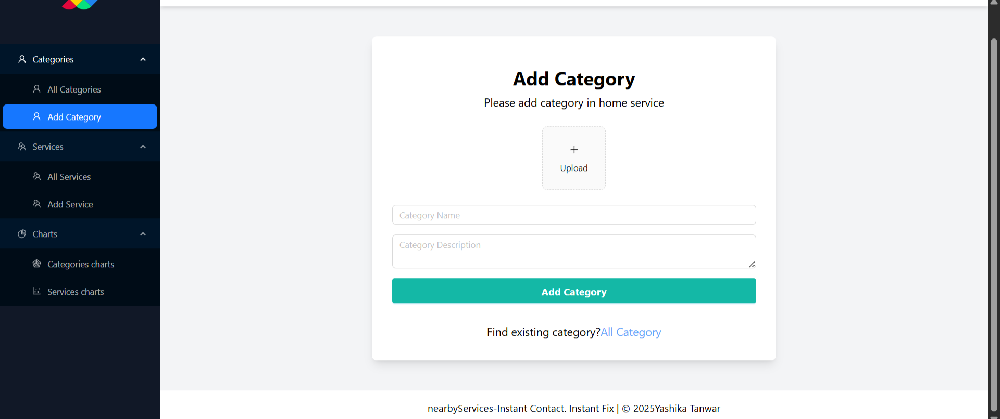
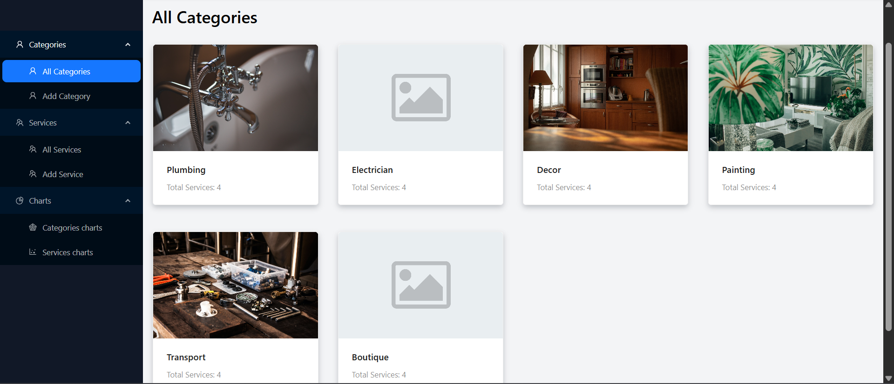
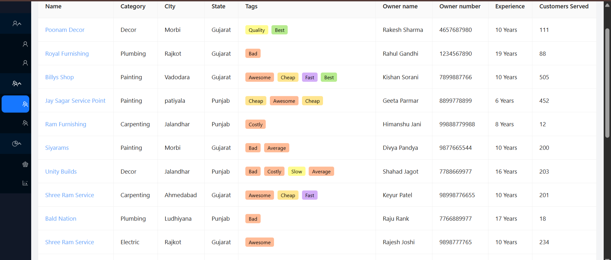
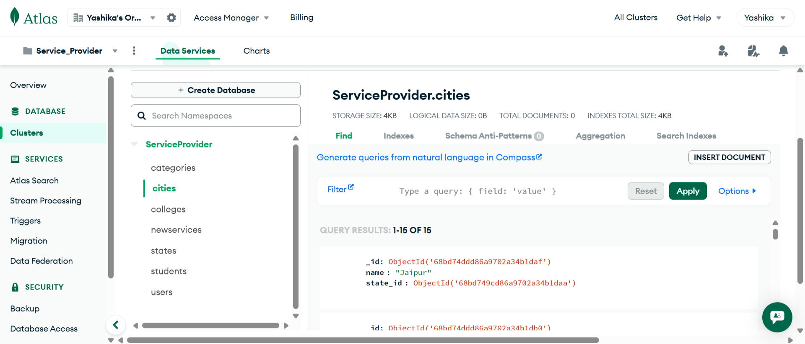
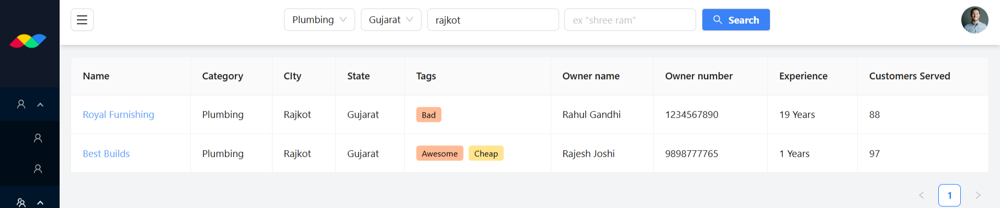
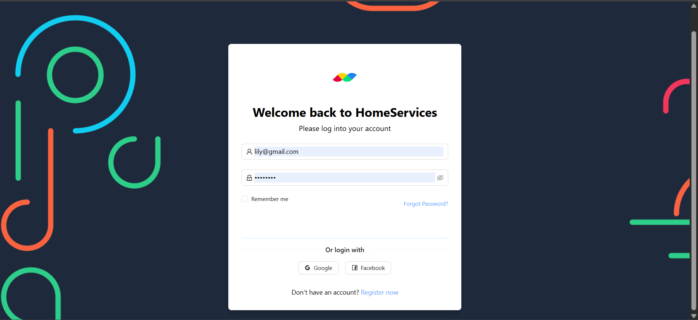
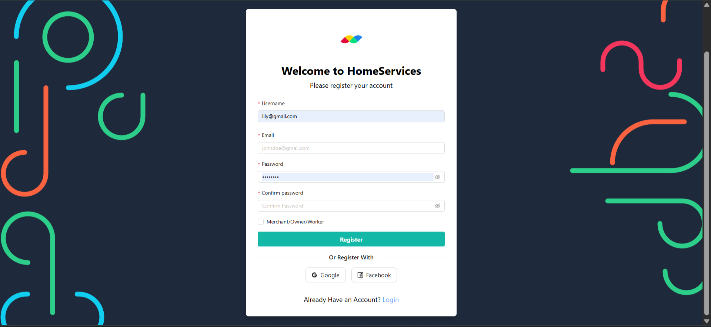
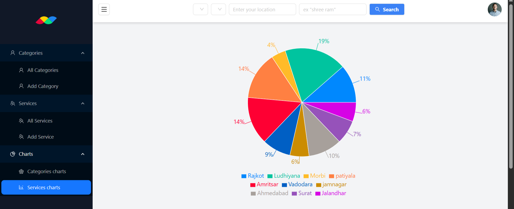

# nearbyServices 🚀 – Instant Contact. Instant Fix.

## Project Overview

**nearbyServices** helps users instantly find local service providers nearby, from plumbers and electricians to cleaners and more. Users can search, view, and contact service providers directly. Service providers can also list their services, making it easy to connect with customers in real time.

Key features include:

- Find nearby service providers quickly 📍
- Contact providers instantly via app or phone 📲
- List your services for customers to find you 🛠️
- Categorized services for easy browsing 🗂️

---

## Screenshots & Features

### Add Categories 🗂️

Easily add new service categories for users to explore:  


### View All Categories 🏷️

Check all service categories at a glance:  


### Browse All Services 🛠️

Explore all available services instantly:  


### Categories Chart 📊

Interactive visualization of service categories:  


### Database Overview 🗄️

Efficient storage of all services and users:  


### Filter & Search 🔍

Quickly find the service you need with filters:  


### Login & Register 🔑

Secure authentication for users and providers:  
  


### Profile & Dashboard 👤

Manage your account and track services:  


### Service Analytics 📈

Visual charts to analyze services performance:  


---

## Technology Overview

**Frontend:**

- **React** – Component-based UI library for building responsive interfaces ⚛️
- **Tailwind CSS & Ant Design** – Fast, customizable UI styling 🌈
- **Recharts** – Interactive chart visualizations 📊
- **Connected React Router** – Smooth routing and navigation 🔀

**Backend:**

- **Express.js** – Fast, minimalist Node.js framework ⚡
- **MongoDB** – NoSQL database for flexible data storage 🗄️
- **Mongoose** – Elegant MongoDB modeling for Node.js 💻
- **dotenv** – Environment variable management 🔒
- **CORS & Nodemon** – Middleware and development tools

**Other Libraries & Modules:**

##### Frontend


##### Backend


---

## Getting Started

### Installation

Clone the repo and run:

````bash
npm install
# or
yarn install


## Getting Started

### Installation

Clone the repo and run:

```bash
npm install
# or
yarn install
````

### Start Frontend

```bash
npm run start:client
# or
yarn run start:client
```

Open [http://localhost:3000](http://localhost:3000) in your browser.

### Start Backend

1. **Environment Setup:**
   Create a `.env` file in the root directory with:

   ```plaintext
   PORT=5000
   DB_STRING=<YOUR_DB_STRING>
   NODE_ENV=development
   API_VERSION=/v1
   SECRETE=<YOUR_KEY>
   GMAIL=<YOUR_GMAIL>
   GMAIL_PASSWORD=<YOUR_GMAIL_PASSWORD>
   ```

2. **Install Dependencies:**

```bash
npm install
# or
yarn install
```

3. **Start Server:**

```bash
npm run start:dev
# or
yarn run start:dev
```

The server runs on [http://localhost:5000](http://localhost:5000).

Built with ❤️ by Yashika Tanwar | 2025
